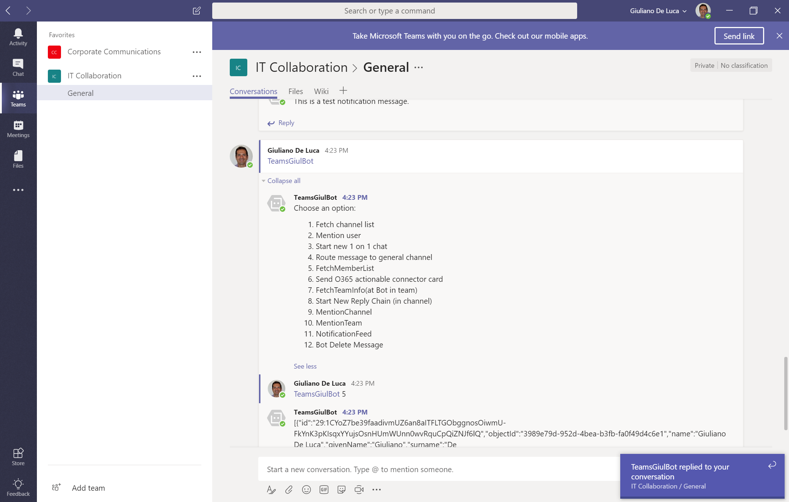
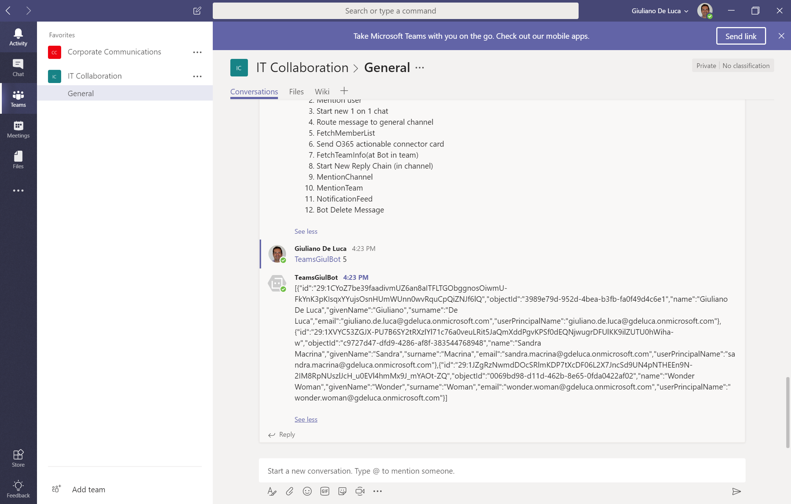
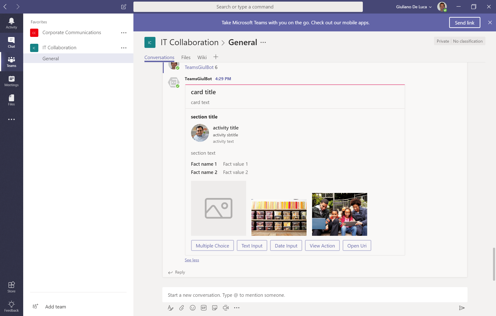
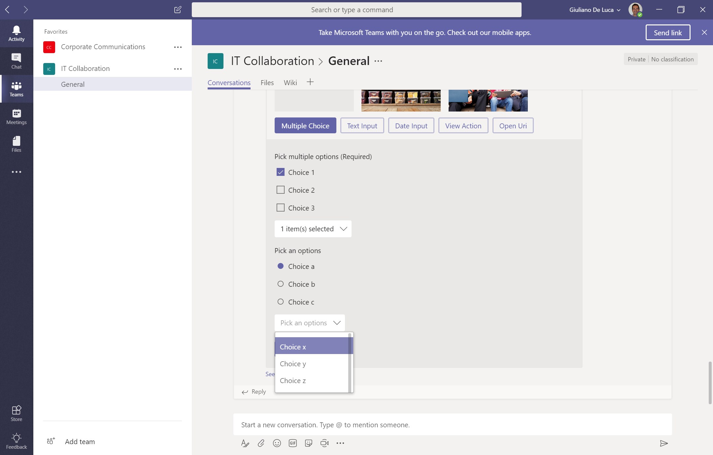
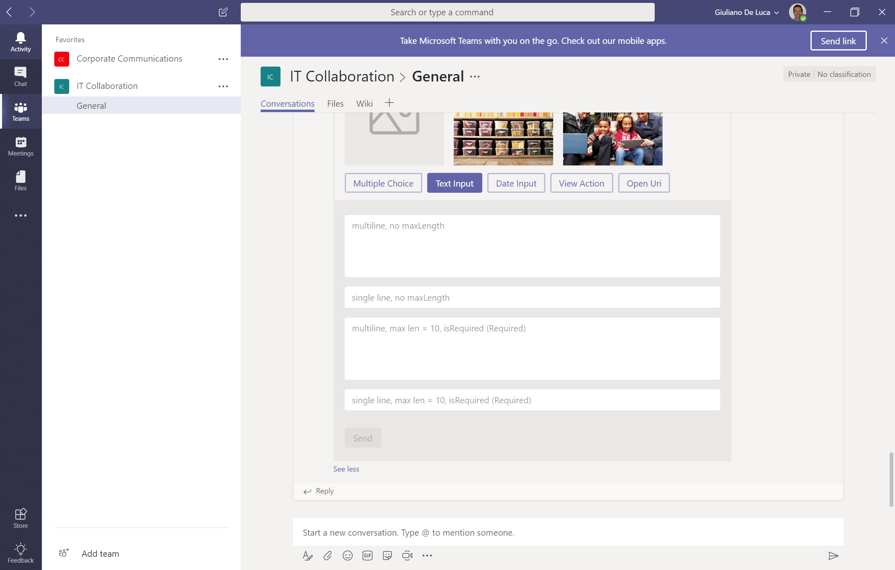

# Teams Bot API #

## Summary ##

This sample demonstrates how to leverage Microsoft Teams API across a Bot.

[Blog post here https://www.delucagiuliano.com/building-a-microsoft-teams-bot](https://www.delucagiuliano.com/building-a-microsoft-teams-bot)

### When to use this pattern? ###
This sample is suitable when you want to implement a Microsoft Teams Bot and leveraging its API. 

  
  
  
  
  
  

## Solution

Solution|Author(s)
--------|---------
teams-bot-API | Giuliano De Luca (MVP Office Development) - Twitter @giuleon

## Version history

Version|Date|Comments
-------|----|--------
1.0 | Marz 17, 2018 | Initial release

## Disclaimer
**THIS CODE IS PROVIDED *AS IS* WITHOUT WARRANTY OF ANY KIND, EITHER EXPRESS OR IMPLIED, INCLUDING ANY IMPLIED WARRANTIES OF FITNESS FOR A PARTICULAR PURPOSE, MERCHANTABILITY, OR NON-INFRINGEMENT.**

---

## Minimal Path to Awesome

- Clone this repository and follow the instructions below

## Prerequisites ##
 
### Deploy the solution on Azure or run it locally ###
- You can create a new Bot on Azure and copy paste the content in the files **app.js** and **package.json**
- Install ngrok and run locally on your machine the Bot
